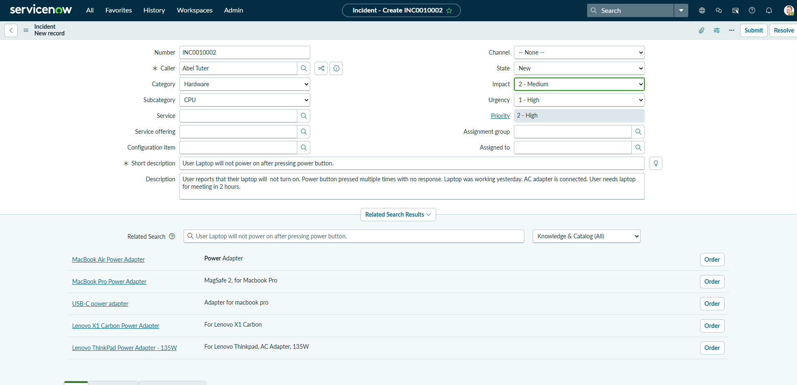
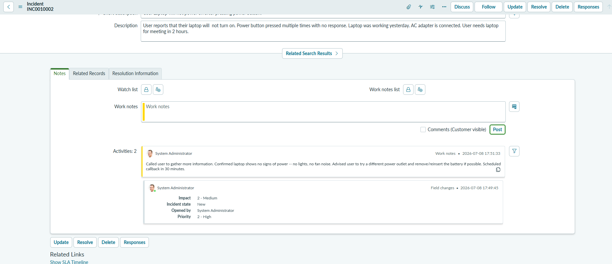
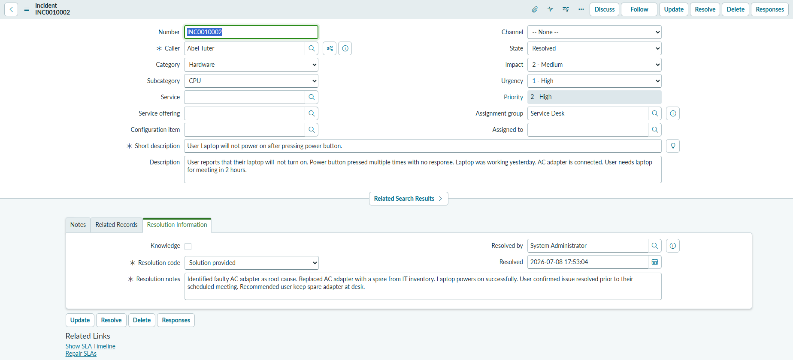
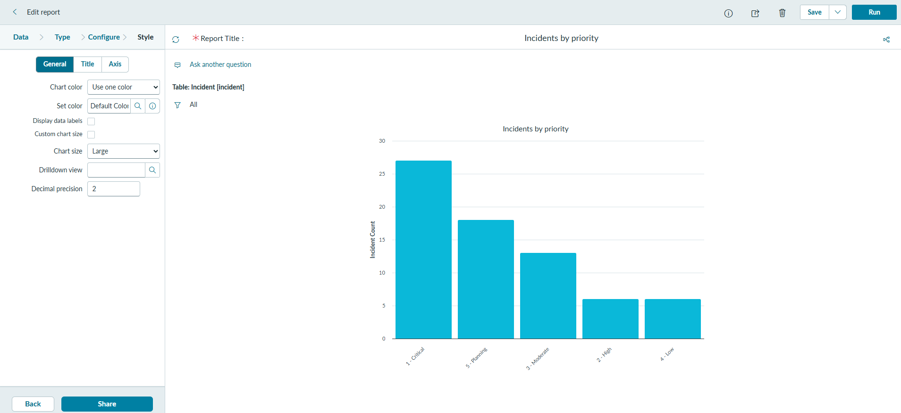

# ServiceNow ITSM Lab — Incident Management & Reporting

## Overview

This project documents hands-on work in a **ServiceNow Personal Developer Instance (PDI)**, focused on the core ITSM (IT Service Management) workflows a Tier 1/Tier 2 support tech uses daily: creating and working incidents through their full lifecycle, then building a report to visualize ticket data.

**Goal:** Get comfortable navigating ServiceNow as an agent — from ticket creation through resolution — and pull that data into a reportable format, since triage and reporting are both core parts of a help desk role.

**Skills demonstrated:**
- Incident lifecycle management (New → In Progress → Resolved)
- Ticket prioritization using Impact/Urgency
- Work notes vs. customer-visible comments
- Navigating the Application Navigator, list views, and the Report Designer
- Building a bar chart report grouped by a ticket field (e.g., Priority)

---

## 1. Incident Creation

Created a sample incident from the Incident list view (`Incident > New`), simulating a real support call:

- **Short description**, **Caller**, **Category**, **Impact**, and **Urgency** filled out on the incident form
- Priority auto-calculated from the Impact/Urgency matrix rather than set directly — an important distinction, since Priority isn't a free-choice field in a properly configured instance

---

## 2. Incident Workflow

Worked the ticket through its active states:

- Set **State** to In Progress and assigned it to self
- Logged **work notes** — internal-only troubleshooting detail, not visible to the caller
- Added a customer-facing **comment** summarizing progress, kept separate from the internal work notes

This split between work notes and comments matters in real support work — internal detail should never leak into a customer-facing update.

---

## 3. Incident Resolution

Closed out the lifecycle:

- Set **Resolution Code** and **Resolution Notes**
- Moved the incident to **Resolved**

---

## 4. Report Creation

Built a report off the Incident table to visualize ticket data:

- Opened the **Report Designer** (`All > Reports`, then **New**)
- Set **Source table** to Incident, chart **Type** to Bar, and **Group by** to Priority
- Report renders as a live bar chart showing incident volume by priority level

---

## Key Takeaways

- **Priority is calculated, not chosen** — understanding the Impact × Urgency matrix matters for triaging tickets correctly instead of guessing.
- **Work notes vs. comments** is a distinction that carries into real support work: internal troubleshooting steps and customer-facing updates serve different audiences and shouldn't mix.
- Getting comfortable with the **Report Designer** turns raw ticket data into something a team lead or manager can actually act on — useful beyond just working individual tickets.

---

## Next Steps

- [ ] Explore the **CMDB** and link an incident to a specific Configuration Item (asset)
- [ ] Write a **Knowledge Base article** based on a resolved incident
- [ ] Build a second report grouped by **Category** or **Assignment group** to compare ticket volume across teams

---

*Part of my IT homelab portfolio — see also the [Active Directory homelab on AWS EC2](../active-directory-aws-ec2.md) and [ThinkPad T14 shutdown fix](../thinkpad-t14-shutdown-fix.md).*
